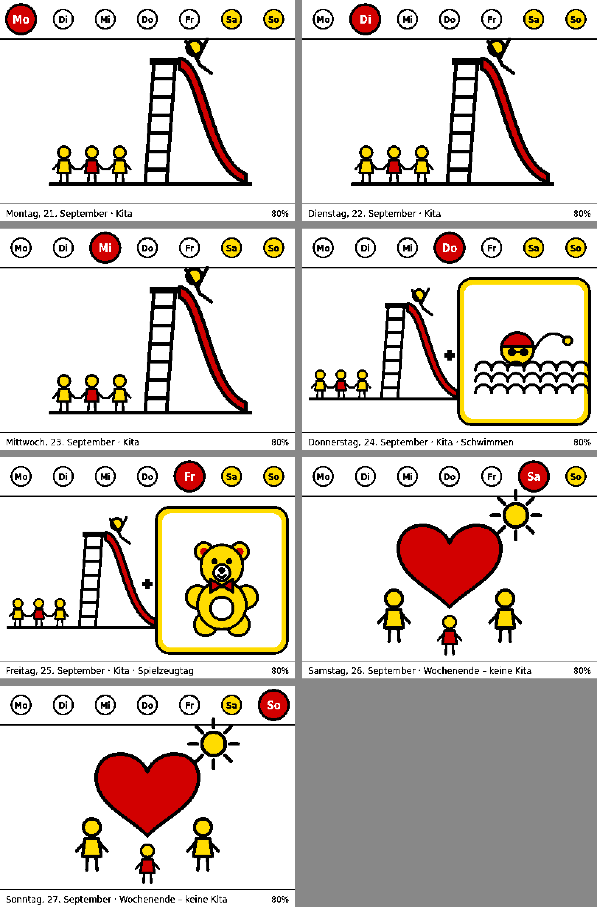

# Kita-Board

Ein Wochenplan in Bildern für Kinder, die noch nicht lesen können, auf einem **ZecTrix NOTE4C**
(4,2″ E-Paper, Schwarz/Weiß/Gelb/Rot):

| Tag | Bild |
| --- | --- |
| Montag – Freitag | **Kita** (rote Rutsche, Kinder an den Händen) |
| Donnerstag | Kita **+ Schwimmen** (Kopf mit Badekappe über Wellen) |
| Freitag | Kita **+ Spielzeugtag** (Teddybär) |
| Samstag, Sonntag | **Wochenende, keine Kita** (Familie unter einem Herz) |
| Berliner Feiertage, Kita-Schließtage | wie Wochenende |

**Live:** https://kita-board-eosin.vercel.app · Firmware: https://kita-board-eosin.vercel.app/flash

Oben zeigt eine Wochenleiste Mo–So, der heutige Tag ist groß und rot markiert. Unten steht klein eine Textzeile
für Erwachsene.



## So funktioniert es

```
NOTE4C (TRMNL-Firmware) ──► Vercel-App /api/display ──► Tagesbild als PNG
```

* Gerät: die Open-Source-[TRMNL-Firmware für ZecTrix](https://github.com/LitoMore/trmnl-firmware/tree/zectrix)
  (auf echten NOTE4C getestet), installiert über `https://DEINE-URL/flash`.
* Das Gerät schläft höchstens 4 Stunden am Stück und wacht spätestens um 5 Uhr morgens auf.
  Ändert sich das Bild nicht, zeichnet es nicht neu (kein Flackern). Das Bild wechselt also einmal am Tag.
* Die OK-Taste (rund, vorne) lädt sofort neu; 5 s halten = WLAN neu einrichten.

## Einrichten

1. **Vercel:** Projekt aus diesem Repo importieren (Framework „Other“) und deployen.
2. **Firmware:** `https://DEINE-URL/flash` in Chrome/Edge öffnen → **Installieren** → Gerät wählen → Install.
   Danach die untere Taste rechts halten, bis das Display wechselt.
3. **WLAN:** Handy mit `TRMNL-…` verbinden → **Advanced → Custom Server → Yes** → Adresse `https://DEINE-URL`
   eintragen → **Back to Wi-Fi** → WLAN + Passwort → **Connect**.

## Anpassen (Vercel → Settings → Environment Variables, danach Redeploy)

| Variable | Beispiel | Bedeutung |
| --- | --- | --- |
| `KITA_CLOSED` | `2026-12-21..2027-01-02,2026-10-30` | Schließtage der Kita (Bereiche mit `..`), dann erscheint das Zuhause-Bild |
| `TRMNL_SECRET` | beliebig | optional, fließt in die API-Keys der Geräte ein |

Wochentage für Schwimmen und Spielzeugtag stehen in [`lib/plan.js`](lib/plan.js) (`SWIM_DAY`, `TOY_DAY`).

## Endpunkte

| Pfad | Zweck |
| --- | --- |
| `/` | Vorschau heute + ganze Woche |
| `/flash` | TRMNL-Firmware installieren |
| `/api/screen?date=YYYY-MM-DD` | Bild für einen Tag (PNG) |
| `/api/setup`, `/api/display`, `/api/log` | TRMNL-Protokoll |

## Entwickeln

```sh
npm install
npm test
npm run preview   # alle 7 Tage nach out/week.png
```

## Lizenzen

Code MIT. Schrift DejaVu (`fonts/LICENSE-DejaVu.txt`). TRMNL-Firmware GPL-3.0, unverändertes Release-Binary in
`public/firmware/trmnl/` (Quelltext und Prüfsumme siehe `NOTICE.txt`).
